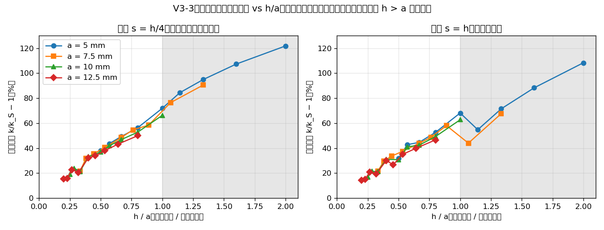

# 第 1.5 步：实验结果

- 调研和设计见 `step1_5_tip_survey.md`（第 0 节为复核后的修订和 V0 计划）。
- 记号：R_phys = 真实针尖半径（18G 约 0.64 mm）；a_eff = 数值等效针尖半径（正则化参数，不等同于 R_phys）。刺穿阈值、切割力等实验参数以后单独标定，不和 a_eff 混在一起（用户 2026-10-01）。

## V0：有限半径接触的复用可行性（2026-10-01，用时约 1 小时，在限时以内）

### B1：SOFA 自带的有限半径接触——停止
- 第一优先级是查清第 1 步 A2"有约束行但反力为 0"的原因。打开约束求解器日志（`printLog`）逐步查看 W、δ、λ〔运行〕：
  - 约束行直到针尖步首位置**正好**落到表面时才出现（alarmDistance = 2 mm 并没有提前生成）；
  - 那一步针尖的自由位置已在表面以下 0.01 mm，但求解器拿到的 δ ≈ −3.9e-18 ≈ 0，而不是约 −1e-5；之后几步 δ = +1e-5、+2e-5、+3e-5……正好等于针尖**步首位置**在表面以下的深度（不带方向的距离 − contactDistance）；
  - 所以 λ 始终为 0。W ≈ 1.01，量级也可疑，没有继续查。
- 推论：SOFA 自带接触计算 δ 时，针尖一侧用的是步首位置而不是自由位置。纯运动学的针没有自由运动，接触映射子节点的自由位置一直等于它的位置，穿透永远不会被判定为负的违反量。
- 尝试过的办法（都无效）：
  - 驱动方式 mode="end" / "start"；
  - 表面法向翻转 / 不翻转；
  - 给针加求解器 + 柔度极小的 `UncoupledConstraintCorrection`（连约束行都没有了）。
- SOFA 里移动器械的常规做法是把器械做成有质量、由硬弹簧拉着的动态物体，这正是 0b 中放弃的方案 A（人为刚度、针尖滑开），属于架构改动。
- **按约定停止 B1**："需要明显修改 SOFA 碰撞流水线或架构"。
- 对 V0 问题 1–3：B1 在纯运动学针上没能产生非零反力，后两个问题没有进行。刺穿时关闭自带接触本身可行（Cosserat 示例的做法），但已无必要。

### B2a：针尖一侧取样（插件多点接触）——可行
- 实现：`contact.tip_patch_points`（同心圆环，点距约等于 h；圆盘或半球）+ `contact.add_tip_patch`（`RigidMapping` 挂在针上 + 插件 `PointGeometry`），交给插件 `InsertionAlgorithm` 的多点接触。**没有新写 C++**。
- 测试：`scenes/step1_5/v0_b2a_patch.py`，规则测试台（swapping=True），R1，5 mm/s 压到 5 mm，a_eff = 10 mm。

| 网格 | 针尖 | 点数 | F_ax（压深 1 / 2.5 / 5 mm） | 接触状态的点数（5 mm） | 侧向 / 轴向 | GS |
|---|---|---|---|---|---|---|
| h = 10 mm | 圆盘 | 9 | 0.201 / 0.493 / 0.950 N | 8/9 | ≤ 2e-12 | 19–22 次迭代，残差约 1e-12 |
| h = 5 mm | 圆盘 | 21 | 0.161 / 0.393 / 0.749 N | 15/21 | ≤ 4e-6 | 20–24 次迭代，残差约 1e-11 |
| h = 10 mm | 半球 | 13 | 0.073 / 0.175 / 0.323 N | **1/13** | 数值零 | 3 次迭代 |
| h = 5 mm | 半球 | 33 | 0.036 / 0.095 / 0.339 N | 9/33（2.5 mm 时 7） | ≤ 1e-10 | 19–35 次迭代，残差约 2e-11 |

- **V0 问题 1（非零反力）**：两种针尖都稳定产生非零反力，没有异常大的 λ，GS 收敛。
- **V0 问题 2（接触数量、位置、总力是否合理）**：
  - 圆盘：网格从 10 mm 加密到 5 mm，刚度从约 201 N/m 降到约 161 N/m（−20%）。和 0a-2 节点压头完全同样的趋势〔运行，0a-2 表 3：h = 10 / 5 mm 时 177 / 约 142 N/m，同样 −20%；0a-2 已证明该序列外推到 Sneddon 解 ±1%）。初步说明点距约等于 h 的圆盘在朝收敛的方向走，V3 正式验证。
  - 圆盘中有一部分点处于不受力状态（1/9、6/21）〔运行〕。可能的原因〔推论，未查证〕：几个点落在同一个三角形里，约束行线性相关，力在这些点之间的分配不唯一；只是总力唯一，GS 也正常收敛。也可能是网格离散后，边缘处有些点没有真正压进去。V5 中查清是哪种情况。
  - 半球：接触从最低点一个点开始，随压深扩大，符合球形压头的特点。但 **h = 10 mm 时压到 5 mm 仍只有 1 个点接触**，力和第 1 步的点接触完全相同（0.323 N）。第二圈点比最低点高约 2.9 mm，凹坑边缘的组织下沉也差不多，一直没碰上。所以粗网格上半球在相当长的压深内就是点接触，依赖网格。h/a_eff 要多小，由 V3 / V4 回答。
- **V0 问题 3（总力读取、刺穿时的衔接）**：
  - 总力由针尖面片 MO 的 J 和 λ 读出（`common.needle_wrench`），侧向分量是数值零。
  - 插件的刺穿判据〔代码，`InsertionAlgorithm.cpp:164-197`〕：对针尖几何 MO 上的所有点求 Σ‖λᵢ‖/dt，和阈值比较。面片作为 `tipGeom` 时可以直接用。
    - 注意：这是"各点力的模长之和"，不是"合力"。圆盘上各点的力都沿轴向，两者相等；半球上各点的力有侧向分量（合起来抵消），所以 Σ‖λᵢ‖ 略大于合力。第 2 步要决定判据用哪一个〔推导〕。
  - 超过阈值的那一步，循环里**每个**针尖点都会 `m_couplingPts.push_back(surfProx)`（`:193-196`），也就是每个面片点都生成一个耦合点。插入阶段只用 `l_tipGeom->begin()`（`:260`）。所以要改成刺穿时只在针轴上建 1 个耦合点（第 2 步之前，小改动）〔代码〕。
- **V0 问题 4（接入代价）**：

| 路线 | 接触 | 接到刺穿状态机 | 估计代价 |
|---|---|---|---|
| B1 SOFA 自带接触 | 纯运动学针上不产生力 | 需要控制器切换 | **高**：要改针的架构（动态针 + 弹簧）或深入 SOFA 碰撞流水线 |
| **B2a 针尖一侧取样** | **已可用，无新 C++** | 插件状态机原生支持；只需改"刺穿时的耦合点"（继承插件算法，覆盖刺穿那一段，估计几十到一百多行 C++） | **低** |
| B2b 组织一侧取样（半径内组织顶点） | 要新写检测算法，还要处理半径偏移（插件单边约束没有偏移量） | 同 B2a | 中（估计约 200 行 C++ + 验证） |

### V0 的结论
- **B1 停止**；**B2a 可行且代价最低**。验证工具（平底圆盘）和正式针尖的候选（半球 / 圆头）都可以用 B2a 实现。
- V5 已完成（见下）。下一步（2026-10-01 修订，见 survey §5、§7）：按 V5 → V1 → V2 → V3 → V4 的顺序。圆盘作为机制开发替身和验证基准；V3 / V4 照测半球，只量出网格代价，不决定最终针尖。B2b 暂不实现，如果 V2 / V5 显示针尖一侧取样有无法接受的问题再考虑。

## V5：不受力的点是"真正脱离接触"还是"约束冗余"（2026-10-01）
- 脚本：`scenes/step1_5/v5_inactive_points.py`。数据：`results/step1_5/v5_inactive_points.json`，日志 `.log`。
- 测试台同 V0（a_eff = 10 mm，R1，5 mm/s）。在压深 0.05、0.1、0.25、0.5、1、2.5、5 mm 逐行记录：
  - 该行属于哪个针尖点、投影节点和重心权重、λ；
  - 求解后的间隙 g = n·(x_tip − Σw x_node)（g > 0 表示分开）；
  - 表面 J 的秩、同一组投影节点上的点数。
- 判据：λ = 0 且 g > 0 ⇒ 真正脱离接触；λ = 0 且 g ≈ 0 ⇒ 冗余 / 退化。

| 情形 | 行数 | 表面 J 的秩 | 同组最多点数 | 不受力的点 | 不受力点的间隙（压深 0.05 / 1 / 5 mm） | 受力点的间隙 |
|---|---|---|---|---|---|---|
| h = 10 圆盘 | 9 | 9（满秩） | 2–3 | 圆心 1 个 | +0.017 / +0.22 / +1.31 mm | ≤ 7e-10 mm |
| h = 5 圆盘 | 21 | 21（满秩） | 2 | 内圈 8 点中的 6 个（0°、45°、135°、180°、225°、315°） | +0.0017 / +0.034–0.044 / +0.27–0.29 mm | ≤ 2e-9 mm |
| h = 5 半球 | 33 | 33（0.05 mm 时 21，见注） | 2 | 未接触的上层圆环 | 和圆环高度一致（1.3 / 5 / 10 mm 量级） | ≤ 4e-9 mm |

### 结论〔运行〕
1. **不是约束冗余**：受力点所在的约束行都线性独立（表面 J 满秩），每组投影节点上最多 2–3 个点。
2. **是真正的脱离接触**：不受力点的间隙为正，并且从最小压深 0.05 mm 起就**和压深近似成正比**（h = 10：g/d 约 0.35 → 0.26；h = 5：约 0.03–0.06）。
   - 所以它是**离散线性问题本身**的性质，不是大变形非线性造成的。
   - 修正我之前的预测〔推导，已被推翻〕：我曾说"线性理论下平底压头整个面受压，小压深下应该全部受力"。这对连续体成立（Sneddon 压力 p(r) ∝ 1/√(a²−r²)，中心压力最小但仍为正），对这个离散模型不成立。
   - 解释〔推论〕：压力集中在圆盘边缘。边缘的点有一部分落在三角形内部，重心约束 Σw u = δ 会把共享节点往下拉，于是圆心或内圈的组织表面沉得比圆盘还深，和圆盘分开。
3. **随网格加密，脱离程度明显减小**：g/d 从约 0.3 降到约 0.04，趋向连续体的"整面接触"。这是好迹象，V3 中继续跟踪。
4. h = 5 圆盘内圈不受力的点关于 x、y 不对称：90° 和 270° 的点受力，0° 和 180° 的点不受力。来源是四面体切分对 x↔y 不对称（第 1 步已知的网格各向异性）。M_tip 仍然很小（≤ 7e-7 N·m），对总力影响小。
5. 注：半球在 0.05 mm 时秩为 21 < 33，因为远处的点（高 5–10 mm）投影到同一个顶点，约束行相同。这些点间隙很大、不受力，不影响结果，但白白占了约束行。`DistanceFilter`（现在是 20 mm）以后可以收紧。

### 对 V1 的影响
- V1 的参照按 active-set 定义是**必需的**，不是可选的：参照要用同一个雅可比的线性柔度矩阵求 LCP。预测：LCP 会给出同样的不受力点集（因为这个现象在小压深下就存在，是线性的）。
- 冗余没有出现，所以 C 可逆。可以比较合力，也可以逐点比较 λ（解唯一）。

## V1：多点圆盘接触 vs 同一离散接触雅可比的 LCP 参照（2026-10-01）
- 脚本：`scenes/step1_5/v1_multipoint_lcp.py`（主测试）、`v1_transient.py`（刚接触后的过渡）。数据：`results/step1_5/v1_*.json`，日志 `.log`。
- **想证明什么**：V5 里不受力的点是同一离散问题的**正确解**，不是求解器或插件的错误。也就是说，SOFA + 插件的动态接触结果等于同一网格、同一组投影和重心权重下的精确解，包括受力点集合、合力、逐点力。
- **参照**（静力、线性、同一雅可比）：
  - 在所有投影节点的 3 个分量上施加 ±1 mN 的静力（对称差分），得到节点柔度 C；
  - 接触柔度 W = Bᵀ C B，B 的第 r 列为 n_r ⊗ w_r，n、w 取动态接触在该压深实际使用的值；
  - 线性化间隙 g = q + Wλ；
  - 求解 LCP：λ ≥ 0，g ≥ 0，λ·g = 0（Cholesky + NNLS，精确解）。
- **动态接触**：同 V0 / V5 的测试台，0.2 mm/s 准静态压到 0.05 mm（线性范围）。
- **反面对照**："全部点接触"参照 λ = −W⁻¹q（不要求 λ ≥ 0）。

| 情形 | 压深 | 不受力点（动态 / LCP） | 合力相对差 | 逐点 λ 最大差 / λmax | 不受力点间隙（动态 / LCP） | 作用 = 反作用 | 全部点接触：拉力点数、合力偏差 |
|---|---|---|---|---|---|---|---|
| h = 10 | 0.05 mm | 圆心 / 圆心 ✓ | **+1.5e-4** | 2.1e-4 | 1.062e-2 / 1.060e-2 mm | 5e-20 | 1 个，+3.7% |
| h = 5 | 0.05 mm | 内圈 6 点 / 同样 6 点 ✓ | **−4.5e-4** | 7.4e-4 | 2.10e-3 / 2.09e-3 mm 等 | 4e-16 | 6 个，+0.47% |
| h = 10 | 0.02 mm | 一致 ✓ | −1.4%（过渡，见下） | 1.4% | 4.18e-3 / 4.24e-3 mm | 2e-16 | — |
| h = 5 | 0.02 mm | 一致 ✓ | −1.7%（过渡） | 1.7% | — | 4e-16 | — |

- W 的数值不对称 ≤ 1.6e-6（柔度矩阵对称，参照计算本身可信）；条件数 16 / 55；GS 15–17 次迭代。

### 刚接触后的过渡（`v1_transient.py`，h = 10）
| 压深（mm） | 0.002 | 0.004 | 0.006 | 0.01 | 0.016 | 0.02 | 0.03 | 0.04 | 0.05 |
|---|---|---|---|---|---|---|---|---|---|
| 动态 / LCP − 1 | +106% | +41% | +20% | +2.5% | −2.9% | −1.4% | +0.5% | −0.2% | +0.015% |
- 差别是**衰减振荡**：组织原本静止，接触时突然以 0.2 mm/s 被带动，产生惯性过渡，靠隐式欧拉的数值阻尼衰减（和 0a-3 的结论一致）。约 0.25 s 后（压深 0.05 mm）衰减到 1.5e-4。绝对量很小：最大约 4e-4 N。
- 所以 0.05 mm 处的比较代表准静态结果；0.02 mm 处的约 1.5% 差别来自动力学，不是接触实现的误差〔运行〕。

### 结论
1. **V1 通过**：两种网格下受力点集合**完全一致**；准静态下合力差 ≤ 5e-4，逐点 λ 差 ≤ 7e-4，不受力点的间隙也一致；作用力 = 反作用力到舍入误差。和第 1 步单点 P2 的精度（0.05%）同量级。
2. **V5 中不受力的点是同一离散问题的正确解**，不是求解器或插件的错误。
3. **active-set 参照是必需的**："全部点接触"的参照会出现拉力（h = 10 有 1 个点，h = 5 有 6 个点），合力偏高 3.7%（h = 10）和 0.47%（h = 5）。加密后偏差变小，和 V5 中"分开程度随加密减小"一致。
4. 多点接触的读力（`needle_wrench` 合力 + 合力矩）可靠；对称圆盘的 |M_tip| ≤ 1e-12 N·m。
5. 代价：h = 5 的柔度矩阵用了 691 s（21 个节点 × 6 次静力求解），V3 的四分之一模型和 h = 2.5 mm 需要更快的办法（例如一次分解、多右端项）。

## V2：落点依赖（2026-10-01）
- 脚本：`scenes/step1_5/v2_placement.py`。数据：`results/step1_5/v2_placement.json`，日志 `.log`。
- 方法：
  - 测试台同 V1（a_eff = 10 mm 圆盘，点距约等于 h）；
  - 针轴平移到中心 + (ox, oy)·h，6 个落点：顶点 (0,0)、第 1 步 P2 的 3 个三角形内部位置、边中点 (0.5,0)、方格中心 (0.5,0.5)；
  - 每个落点同时跑单点针尖作对照；
  - 0.2 mm/s 准静态压到 0.05 mm，k = F_z / 0.05 mm；
  - 另记录压力中心偏移 = (−M_y, M_x)/F_z（相对针轴）。
- 判据：圆盘刚度在各落点之间的变化 ≤ 约 10%。

| 网格 | 针尖 | k 范围（N/m） | max/min − 1 | 压力中心偏移（相对 a_eff = 10 mm） | 受力点数 |
|---|---|---|---|---|---|
| h = 10 | 单点 | 74.7–124.4 | **+66.5%** | 0 | 1 |
| h = 10 | 圆盘 | 203.5–208.0 | **+2.2%** | 0.6–1.3 mm（约 10%） | 6–8 / 9 |
| h = 5 | 单点 | 38.1–64.4 | **+69.3%** | 0 | 1 |
| h = 5 | 圆盘 | 163.8–170.6 | **+4.1%** | 0.04–0.46 mm（≤ 5%） | 13–16 / 21 |

- 单点对照和第 1 步 P2 一致（h = 10：74.7 / 106.2 / 124.4 / 115.8 N/m，P2 为 74.7 / 106.3 / 124.4 / 115.9），说明测试台没有变化。
- 圆盘的侧向 / 轴向 ≤ 2e-4（压平面，无摩擦）。

### 结论〔运行〕
1. **V2 通过**：有限支撑把落点依赖从约 67% 降到 2–4%，远低于约 10% 的判据。
2. h = 5 的变化（4.1%）比 h = 10（2.2%）略大。原因是**对称落点（圆心在顶点）是个特例**：圆心和两圈点上沿 x、y 轴的点都正好落在网格顶点上，而顶点接触偏软（第 1 步发现）。去掉这个落点，其余 5 个落点之间只差 0.8%（169.3–170.6 N/m）。h = 10 时对称落点没有表现出这种偏软，各落点之间的差别本身就在 ±1% 量级。
3. 压力中心偏离针轴的程度随加密减小（h = 10 约 10% a_eff → h = 5 ≤ 5%）。对刚性针来说，这个偏移只产生一个小力矩，不影响轴向力。到柔性针阶段它会变成弯曲载荷，那时要再看。
4. 受力点数随落点变化（h = 10：6–8 / 9），但合力很稳定：多点支撑把"哪些点受力"的离散性平均掉了。
- 刚度绝对值只在粗测试台上有意义（粗规则网格的力值不具有物理定量意义）。网格收敛和与 Sneddon 解的比较在 V3 中做。

## V3：平底圆盘的网格 / 布点收敛（2026-10-01）
- 设计（用户、ChatGPT、Claude 讨论后确定）：
  - V3-0 先做等价检查，再提速；
  - V3-1 用 a_eff = 10 mm，做 h × s 网格；
  - V3-2 换 a_eff = 5 mm，检验误差是否只取决于 h/a；
  - 半球另做（V3b）；
  - 不设 5% 门槛，交付"误差 vs h/a_eff"的趋势；拟合允许 k∞ ≠ k_S；s = h/4 只有在 h、h/2、h/4 形成平台时才作为有限元极限的近似。
- 全部是**线性小压深**静力 LCP（V1 已证明动态接触 = LCP），h 和 s 的单位是 mm。参照 k_S = 2aE/(1−ν²) = 125.39 N/m（a = 10 mm）/ 62.70 N/m（a = 5 mm）。

### V3-0：新工具的等价检查（`scenes/step1_5/lcp_tool.py`、`v3_0_equivalence.py`）
- 新工具：
  - 直接取 SOFA 组装的静力切线刚度 K（`MatrixLinearSystem.get_system_matrix()`，StaticSolver，未变形构形）；
  - scipy LU 只分解一次，每个接触点一个右端项；
  - 投影和权重在未变形的顶面三角形上直接计算；
  - 支持四分之一模型：对称面上的点载荷系数 φ = 1/2，交点 φ = 1/4，全模型合力 = 4Σμ。
- **K 确实是静力切线刚度**〔运行〕：矩阵对称，固定自由度对应单位行；K⁻¹f 和 SOFA 一次 Newton 迭代的位移一致到 1.4e-12；和收敛的非线性解差 1.8e-4（1 mN 下的几何非线性）。

| 检查 | h = 10 | h = 5 |
|---|---|---|
| (a) 同一雅可比（喂入 V1 动态接触实际的投影 / 权重 / 法向 / 间隙）vs V1 参照 | 合力 +1.9e-7，逐点 λ 7e-7，受力点集合一致 | +2.5e-6，2e-5，一致 |
| (b) 完整新流程（未变形雅可比）vs V1 | +1.5e-4 | +6e-5 |
| (c) 四分之一模型 vs 全模型 | −7e-13 | −4e-13 |
- 四分之一模型和全模型一致到舍入误差：swapping=True 的切分在四分之一网格上是严格镜像，对称边界条件和 φ 都正确。
- 提速：h = 5 从 691 s 降到 0.3 s。
- 限制：h = 1.25 的四分之一模型（约 21 万自由度）用 scipy SuperLU 分解时内存超过 15 GB，56 分钟后失败，**没有做**。

### V3-1 / V3-2 结果（`v3_1_convergence.py`、`v3_2_aeff.py`；数据 `results/step1_5/v3_1_convergence.json`、`v3_2_aeff.json`）
k/k_S（括号内为受力点 / 总点数，全模型等效）：

| a | h | h/a | s = 固定 10 | s = h | s = h/2 | s = h/4 |
|---|---|---|---|---|---|---|
| 10 | 10 | 1 | = s = h | 1.627（8/9） | 1.662 | 1.663 |
| 10 | 5 | 0.5 | 1.328（9/9） | 1.307（15/21） | 1.370 | 1.369 |
| 10 | 2.5 | 0.25 | **0.875**（9/9） | 1.170（55/65） | 1.186 | 1.189 |
| 5 | 10 | 2 | — | 2.084 | 2.132 | 2.219（未形成平台） |
| 5 | 5 | 1 | — | 1.682 | 1.719 | 1.719 |
| 5 | 2.5 | 0.5 | — | 1.319 | 1.383 | 1.382 |

### 结论〔运行，另注明的除外〕
1. **布点规则**：
   - "固定点数"（s = 10 mm）**不收敛**：h = 2.5 时 k 已经降到 k_S 以下（0.875），继续加密会趋向独立的点载荷，k → 0。预测得到证实。
   - "点距约等于 h"收敛：h/2 和 h/4 之间差 ≤ 0.25%（h/a ≤ 1 时形成平台），所以 s = h/4 可以作为有限元极限 k_FE(h) 的近似。
   - h/a = 2（圆盘比单元还小）时没有平台，这个范围本来也不可用。
2. **误差拆分**：
   - **布点误差**（s = h 相对有限元极限）：−2.1%、−4.5%、−1.6%（a = 10，h/a = 1、0.5、0.25）。符号为负，大小不随 h 单调变化（取决于圆环和节点是否对齐），但始终 ≤ 5%。
   - **有限元误差**（k_FE / k_S − 1）：+66%、+37%、+19%，是主要部分。
3. **误差可能只取决于 h/a**（证据有限，V3-3 检验）：在相同 h/a 下，a = 5 和 a = 10 的 k_FE / k_S 相差 3%（h/a = 1）和 1%（h/a = 0.5）；布点误差也一致（−2.1 / −2.2%；−4.5 / −4.6%）。如果 V3-3 证实这一点，一条实测的 h/a 曲线就可以用来设计网格（直接读数或插值，不外推）。
4. **之前根据两个网格点做的预测得到证实**："h = 2.5 时约 147 N/m（+17%）"，实测 146.7 N/m（+17.0%）。
   - 粗略描述（**不是公式**）：s = h 时，3 个测点上 k/k_S − 1 大致为 0.6–0.7 × (h/a)（h/a = 0.25–1）。其中包含约 1% 的立方体有限尺寸效应（0a-2）。用户指出（2026-10-02），每个 a 只有 2–3 个网格点，不足以确定函数形式；可靠的只有"网格越细偏硬越少"。V3-3 补测更密的 h 和更多的 a。
5. **k∞ 和收敛阶还定不下来**：三个网格点拟合，固定阶数 1 时 k∞ = 1.01–1.04 k_S；阶数自由时 p = 0.70（k∞ = 0.90 k_S，有限元极限）或 1.22（k∞ = 1.07 k_S，s = h）。h/a = 1 还不在渐近区，所以只用 3 个点不足以区分。要定下来需要 h = 1.25，但做不了（见 V3-0 的限制）。
   - 对网格设计来说不需要外推：可用范围 h/a = 0.25–1 已经直接测到了。
6. **有限元误差的来源**：
   - 和 0a-2 的节点压头比较：同一网格、同样 ν，0a-2 只规定 r ≤ a 节点的位移，得到 168.9 / 138.8 / 129.5 N/m，以约 1.7 阶收敛到 k_S。圆盘的重心约束更硬（208.5 / 171.7 / 149.0），收敛更慢。
   - 检验了一个假设：边缘三角形被整体压平，使支撑半径扩大到 a + βh。**严格形式被否定**：r > a 处没有节点被完全压到 δ。
   - 但存在部分扩大〔运行 + 推论〕：h = 2.5、s = h/4 时，r 在 10–12.5 mm 的节点被带下去 0.78–1.0 δ，在 12.5–15 mm 的节点被带下去 0.56–0.73 δ。连续体 Sneddon 解 u/δ = (2/π) arcsin(a/r) 在同样位置约为 0.59–1.0 和 0.46–0.59。线性单元表示不了边缘处位移的陡降（应力奇异），使边缘外一圈组织被多带下去，相当于支撑变大。这和误差约与 h 成正比一致，但还没有严格证明。

### 对后续的意义
- **网格设计**：针尖附近的局部单元尺寸按实测的"偏硬–h/a_eff"曲线取舍（V3-3 补齐后）。已测到的点：a_eff = 10 mm 时 h = 5 mm 约 +31%，2.5 mm 约 +17%（s = h）。比 2.5 mm 更细的网格还没有数据，不外推。2.5 mm 只是本次实验的最细一档，不是选定值。要和实时预算（约 870 节点）一起权衡。
- 这个偏硬是**已知的、随网格变化的系统误差**。按 §5.2 的原则（a_eff 和 R_phys 分开，刺穿阈值等单独标定），它应当作为数值误差记录下来，不应悄悄吸收进 a_eff。如何处理（接受、修正、还是标定）留到网格设计时和用户讨论。
- **布点规则推荐 s = h**：布点误差 ≤ 5%，约束行最少（h = 2.5、a = 10 时全模型 65 个点；s = h/2 时 229 个，而且出现冗余）。约束行数对实时有影响，V6 测。
- 本节全部是线性小压深；大压深下单元是否翻转留给 V4。

### V3-3：更密的 h 和更多的 a（`v3_3_dense.py`；数据 `results/step1_5/v3_3_dense.json`、`.log`；图 `v3_3_dense.png`）
- 起因（用户 2026-10-02）：每个 a 只有 2–3 个网格点，不足以确定误差和 h/a 的关系。
- 设计：四分之一模型，h = 80/N mm（N = 8、10、12、14、16、20、24、28、32，即 h = 10 … 2.5 mm，9 档）× a = 5、7.5、10、12.5 mm × s = h、h/2、h/4。共 36 个 (h, a) 组合，覆盖 h/a = 0.2–2。用时约 1 分钟。

**结论〔运行〕**：
1. **不同 a 的点基本落在同一条曲线上**："误差主要取决于 h/a"得到较多数据支持。相同 h/a 下，不同 a 之间的差别约 1–4%，有系统性：a 越小略偏硬。原因未查。
2. **"网格越细偏硬越少"是总体趋势，但局部可以有几个百分点的反复**：a = 10 时 h/a 从 0.333 降到 0.286，a = 12.5 时从 0.32 降到 0.267，偏硬反而增加约 2%。原因〔推论〕是圆盘边缘和网格节点的相对位置（a/h 是否接近整数）。所以曲线在约 ±2% 内不光滑，**不宜用一个光滑公式做精细预测**。
3. 读图得到的量级（有限元极限，s = h/4）：h/a ≈ 0.2 时约 +15%，0.3 时约 +20%，0.5 时约 +35–40%，0.75 时约 +50%，1 时约 +65–72%。在 h/a = 0.2–1 内大致随 h/a 线性增加，但这只是对实测范围的描述，**h/a < 0.2 没有数据，不外推**。
4. **s = h 的布点误差**（h/a ≤ 1）：−5.3% 到 −0.1%，符号始终为负。h/2 和 h/4 之间差 ≤ 1%（平台）。h > a 时 s = h 的布点会退化（只剩边缘一圈 4 个点，例如 a = 7.5、h = 8 时比有限元极限低 18%），**不可用**。
5. 结合 V3-1：可用的设计区间是 **h/a ≤ 1，s = h**。用这条实测曲线（插值）选择针尖附近的单元尺寸，偏硬作为已知的系统误差记录。
6. **适用范围**（2026-10-02 复核后补充）：这条 h/a–误差曲线是在**规则均匀四面体测试台**（swapping=True 切分、8 cm 立方体、ν = 0.45、线性小压深）上得到的**经验设计参考**。用 gmsh 生成的非均匀工作网格，单元形状和切分方式都不同，**必须在工作网格上重新验证**（V1–V3 在新网格上重跑），不能把这条曲线直接当作可迁移的误差标定。

## V4：大压深下的数值稳健性包络（2026-10-02）
- 脚本：`scenes/step1_5/v4_large_depth.py`（分 A / B / C 三组并行）、`v4_element_shape.py`（翻转前最差单元的变形方式）。数据：`results/step1_5/v4_large_depth_{A,B,C}.json/.log`、`v4_element_shape_{9,17}.json/.log`。
- **定位**（ChatGPT 复核 2026-10-02）：
  - 这是**数值稳健性包络**，不是用来迁就刺穿阈值的：阈值由物理模型 / 数据决定，如果合理阈值超出包络，应回头改网格 / 针尖 / 材料表示。
  - 20 mm 只是压力测试的上限，不是验证目标（a_eff ≠ R_phys）。
  - 共旋线弹性在大压缩下本身不符合物理，V4 只看数值是否崩溃。
- 设置：全模型（插件不能给对称面上的点施加一半的力），R1，dt = 0.01，swapping=True，ν = 0.45，点距 s = h，5 mm/s 压到 20 mm。
  - d_0.1：最差单元的有符号体积比 V/V0 首次 < 0.1 的压深；d_inv：首次 ≤ 0（翻转）的压深。

| h | 针尖 | a | h/a | d_0.1（mm） | d_inv（mm） | d_inv/h | d_inv/a | 翻转单元位置 |
|---|---|---|---|---|---|---|---|---|
| 10 | 单点 | — | — | 14.10 | 14.85 | 1.49 | — | 针轴旁表层 |
| 10 | 圆盘 | 5 | 2 | 11.85 | 12.30 | 1.23 | 2.46 | 针轴旁（**超出适用范围的负对照**） |
| 10 | 圆盘 | 10 | 1 | 13.40 | 13.75 | 1.37 | 1.37 | 针轴旁（适用范围边界） |
| 10 | 半球 | 10 | 1 | 15.55 | 16.00 | 1.60 | 1.60 | 针轴旁 |
| 5 | 单点 | — | — | 7.00 | 7.40 | 1.48 | — | 针轴旁表层 |
| 5 | 圆盘 | 5 | 1 | 6.65 | 6.80 | 1.36 | 1.36 | 针轴旁（适用范围边界） |
| 5 | 圆盘 | 10 | 0.5 | 11.20 | 11.45 | 2.29 | **1.15** | **圆盘边缘**（r = 7.9 mm，表层） |
| 5 | 半球 | 10 | 0.5 | 8.00 | 8.15 | 1.63 | 0.82 | 针轴旁 |
| 4 | 圆盘 | 10 | 0.4 | 11.65 | 11.85 | 2.96 | **1.19** | 圆盘内靠边缘（r = 6.3 mm，表层） |
| 4 | 半球 | 10 | 0.4 | 10.95 | 11.60 | 2.90 | 1.16 | 针轴附近（r = 2.8 mm，表层） |
| 5（1 mm/s） | 圆盘 | 10 | 0.5 | 11.12 | 11.36 | 2.27 | 1.14 | 圆盘边缘（同 5 mm/s） |

### 结论〔运行，另注明的除外〕
1. **准静态**：1 mm/s 和 5 mm/s 的 d_inv 相差 0.8%，翻转位置相同，力–压深曲线在 1–11 mm 内相差 ≤ 0.3%。所以 5 mm/s 的结果代表准静态。
2. **翻转之前数值基本正常**：在 d_0.1 之前，所有算例的约束求解器都收敛（残差 ≤ 5e-11），侧向力 / 轴向力 ≤ 9e-5，没有非有限值。迭代次数：圆盘和单点最多 72 次；h = 4 的半球在 5.8 mm 之后升到 100–400 次（见结论 6）。最多 516 次出现在单元翻转之后。
   - **预警余量很小**：d_0.1 到 d_inv 只有 0.15–0.75 mm，翻转来得很突然。
3. **翻转机制是剪切，不是竖直压扁**（`v4_element_shape`，5 个算例）：
   - 翻转前的最差单元高度比 0.94–1.23（没有被压扁）；最小主伸长 0.11 左右，方向和竖直方向夹 33–40°；整体转角 31–36°。
   - 这个单元总是夹在"被针尖压下去的节点"和"没被压下去的节点"之间。相邻节点的下沉差和单元尺寸相当时，单元被剪翻。
   - **在位移变化最陡的地方先坏**：单点、半球、以及 h/a = 1 的圆盘在针轴旁边；h/a ≤ 0.5 的圆盘在边缘附近。
   - 修正记录：Claude 在 h = 10 的结果出来后曾口头解释为"表层单元被竖直压扁"，被形状分析否定。
4. **单点**：d_inv ≈ 1.5h，网格越细越早翻转。点接触在大压深下没有可用的安全范围（和第 1 步一致）。
5. **圆盘（h/a ≤ 0.5）**：d_inv ≈ **1.15–1.2 a**，从 h = 5 到 h = 4 基本不变（11.45 → 11.85 mm）。
   - 推翻了 Claude 的预测（"d_inv ≈ 3h，网格越细越早翻转"）。
   - 只有两个网格点，"和网格无关"是初步结论。
6. **半球的表现取决于"中心单元先坏"和"第二圈点先接上"哪个先发生，很脆弱**：
   - h = 5：开头只有顶点接触，载荷集中在中心，针轴旁的单元在 8.15 mm（0.82 a）翻转，比圆盘早。
   - h = 4：针轴旁的单元在 5.9 mm 时 V/V0 降到 0.12，几乎翻转。随后第二圈点接触上组织（受力点从 8 个增加到 18 个），载荷被分摊，V/V0 回升到 0.26；最后在 11.6 mm（1.16 a）翻转。这一段约束求解器迭代 100–400 次，但仍然收敛。
   - 所以半球的安全压深随网格跳变，不能用一两个算例定下来。
7. **包络**：在这个测试台上，a_eff = 10 mm、h ≤ 5 mm 时，圆盘的 d_inv 为 11.45–11.85 mm（约 1.15–1.2 a_eff）。
   - 复核修订（ChatGPT 2026-10-02，Claude 同意）：从 V/V0 < 0.1 到翻转只有 0.15–0.75 mm，所以**工作包络按 d_0.1 理解**，即圆盘可用的大变形范围约 **11 mm 以内**（d_0.1 = 11.2–11.65 mm），而不是"低于 11.45 mm 就安全"。

### 对后续的意义（2026-10-02 用户、ChatGPT、Claude 讨论后确定）
- **V4 关闭**：不在规则网格上继续扩展 V4 算例，现在也不切换材料模型。
- **不是直接可比的量**：11 mm 左右的替身包络和文献中真实刺穿前压深 13–26 mm 不能直接比较，因为 a_eff ≠ R_phys，平底圆盘不是最终物理针尖，E、ν 是验证参数。20 mm 仍然只是压力测试的上限，不是当前模型必须达到的验证目标。
- **翻转的原因不冻结成"材料模型问题"**：V4 直接支持的是"接触引起的位移梯度 → 大剪切 / 扭曲 → 单元翻转"。其中至少混有本构模型（共旋线弹性不惩罚体积趋于 0）、低阶四面体网格、接触 / 支撑几何三个因素，V4 没有把它们分开。
  - 超弹性材料（体积项在 J → 0 时趋于无穷）**列为定量大变形验证阶段需要单独评估的候选**，不是已被证明必须更换的方案。
  - 修正记录：Claude 曾说"翻转本质上是材料模型的问题，超弹性是根本解决方案"，这个说法超出了 V4 的证据，已撤回。
- **第 2 步先做机制验证**：在当前数值包络内，使用明确标记为"仅用于验证"的人工刺穿阈值，验证阈值 → 状态切换、dt 无关性、刺穿时的约束切换、回弹、耦合点的生成和读力。这不属于"为了数值稳定而篡改物理阈值"，因为当前阶段本来就不是物理验证。
  - 进入定量验证时，真实的刺穿力 F_p / 压深 d_p 必须来自目标组织、真实针和实验数据。如果那时要求的刺穿状态超出数值包络，再单独比较超弹性材料、非均匀网格、针尖表示等方案。
- **下一步**：完成第 1.5 步中和后续直接相关的部分：设计非均匀工作网格（gmsh），在新网格上做最小限度的重新验证，以及实时检查（V6）。然后进入第 2 步。V3b（半球 vs Hertz）推迟到定量阶段。
- V4 的结论来自规则测试台，以后要在 gmsh 工作网格上重新验证。

## 工作网格 M0–M2（2026-10-03；方案 `step1_5_mesh_design.md`）
- gmsh 4.15.2 官方 SDK 装在 `~/sofa/tools/gmsh-4.15.2-Linux64-sdk`（本机没有 pip，用户同意改用 SDK）。
- 第一轮固定 a_eff = 10 mm（控制变量）。

### M0：生成和质量（`scenes/mesh/make_graded_mesh.py`；网格和质量报告在 `meshes/step1_5/`，日志 `generate.log`）
- 尺寸场：MathEval（到竖直线段的距离）→ Threshold（线性），Delaunay + `Mesh.Optimize` + `Mesh.OptimizeNetgen`，msh 2.2 ASCII，只含四面体。
  - Netgen 优化明显改善质量：B 的二面角从 13.5–154° 改善到 22.6–137.6°，超出 20–160° 的单元从 1.2% 降到 0；HXT 算法上无效。
- 所有候选：二面角 20.7–142°（没有单元超出 20–160°），minSICN ≥ 0.47，相邻单元尺寸比 p99 ≈ 1.27，没有方向翻转。
- **实际节点数比方案的粗估少约 20–35%**（A：758，粗估约 890；B：987，粗估约 1300），在标注的误差范围内。
- 加密区的平均边长约为目标 h_local 的 1.35–1.4 倍。规则网格切成四面体后平均边长约为 1.26h，所以 gmsh 标称 5 mm 大致相当于规则网格的 h ≈ 5.4 mm〔推导〕。

### M1：导入 SOFA（`common.add_tissue(mesh=…)`、`contact.add_tissue_with_surface(mesh=…)`、`common.load_mesh`；`scenes/step1_5/m1_import_check.py`）
- 拓扑和 npz 完全一致；`MeshGmshLoader` 读 .msh 得到的节点和四面体也完全一致。注意：读取器会**自己从四面体生成三角形**（文件里只有四面体），在场景里直接用读取器时要只链接四面体。
- 有符号体积全为正；顶面三角形的顶点顺序约定和规则网格相同（两者都是按顶点顺序算出的法向朝外，接触方向正常）。
- 规则网格路径回归正常：h = 5 时 k = 163.85 N/m，和 V1 一致。修正记录：第一次改 `add_tissue` 时把规则网格节点建在组织节点之后，导致初始化失败，已恢复原顺序。
- 小压深圆盘接触（0.05 mm，R1）：所有网格都正常出力，侧向力 / 轴向力约 1e-5，压力中心偏移 ≤ 0.46 mm。

### M2：实时预算复测（`m2_timing.py`；R3，dt = 0.01；数据 `m2_timing{,_extra}.json`）
| 网格 | 节点 | 圆盘针尖负载 p95（ms） | W2 负载 p95（ms） | k/k_S（M1） | 相对 U5 的额外偏硬 |
|---|---|---|---|---|---|
| 规则 n = 9（对照） | 729 | 7.1（9 点） | 8.5 | — | — |
| 规则 n = 11（对照） | 1331 | 14.7（9 点） | 19.2 | — | — |
| A_f16g05（R 15，远场 16，g 0.5） | 512 | **7.6** | 7.3 | 1.398 | +5.1% |
| A_far16 | 580 | **9.1** | 7.6 | 1.397 | +5.0% |
| A+_f20g07 | 611 | 10.6 | 9.2 | 1.381 | +3.8% |
| A− | 638 | **9.0** | 7.9 | 1.434 | +7.8% |
| A+_f20g05 | 658 | 12.3 | 10.5 | 1.396 | +5.0% |
| A+_f16g05 | 725 | 13.1 | 11.3 | 1.363 | +2.5% |
| A_g05 | 729 | 10.8 | 9.9 | 1.395 | +4.9% |
| A | 758 | 11.6 | 9.8 | 1.376 | +3.5% |
| A+ | 971 | 17.2 | 15.3 | 1.341 | +0.8% |
| B（h_local = 4） | 987 | 20.1（25 点） | 15.9 | 1.315 | （h 不同） |
| E（h_local = 2.5，离线） | 2052 | 182（65 点） | 65 | 1.200 | （h 不同） |
| **U5**（处处 5 mm，离线参照） | 4041 | — | — | **1.330** | 0 |
- 判据：物理计算 p95 ≤ dt = 10 ms。
- **结论〔运行〕**：
  1. **非结构网格 + 圆盘针尖的实际预算约 600–650 个节点**，低于 0d 的约 870。原因：
     - 870 是按**中位数**插值得到的，而实时判据看 p95；
     - 圆盘针尖增加了 21–25 行接触约束（同一网格上针尖负载比 W2 慢 15–30%）；
     - **耗时不只取决于节点数，加密区越大越贵**（例如 A+_f20g05 有 658 个节点，比 638 个节点的 A− 慢约 35%）。
  2. **非均匀网格比同样 h_local 的均匀网格更硬**：相对 U5 偏硬 +0.8%（A+）到 +7.8%（A−）。加密区越大、远场越细，越接近 U5。这是"粗远场 / 过渡带"带来的额外误差，叠加在 V3 的 h/a 偏硬（U5 本身相对 Sneddon 约 +33%）之上。
  3. **精度和实时直接冲突**：满足 p95 ≤ 10 ms 的只有 A_f16g05、A_far16、A−，额外偏硬约 5–8%；额外偏硬 ≤ 3.5% 的网格都超出预算。
  4. 圆盘针尖的点数对耗时影响很大：E 在 65 个点时针尖负载 182 ms，W2 只有 65 ms。
- **待用户决定**：在精度和实时之间选一组参数（见对话中的选项）。

### 实时标准的修改（用户 2026-10-03）
- "实时"改为**只要求 SOFA 动画播放流畅不卡，不需要按真实速度播放**（慢动作也可以）。具体判据（用户认可）：帧率约 ≥ 30 帧/秒（每帧计算 + 绘制平均 ≤ 约 33 ms），没有明显的长时间停顿。dt = 0.01、R3 不变。
- 因此 M2 中"预算约 600–650 个节点"只是**旧判据（p95 ≤ 10 ms）下**的结论，不再作为限制。网格主要按精度选择。

### M3 筛选：A+ 与 B 系列（用户、ChatGPT、Claude 讨论后决定先筛选再冻结）
- 脚本：`m3_screen.py`（加密区敏感性、落点依赖；工具 `lcp_tool.MeshArrays`）、`v4_large_depth.py M`（大压深）、`m3_gui_scene.py`（流畅度）。数据：`results/step1_5/m3_screen.json/.log`、`v4_large_depth_M.json/.log`、`m3_smooth_batch.log`。
- 新增网格：A++（5 mm，R = D = 25）、B+（4 mm，20）、B++（4 mm，25），以及同尺度的均匀参照 U4（处处 4 mm，7162 个节点，离线）。
- **工具检查**：`lcp_tool.MeshArrays` 用规则网格数组输入时，和原工具完全相同（163.9330 N/m）；在 A+ 上和动态接触（M1）差 4.7e-4，受力点数和压力中心一致。**这同时完成了 A+ 的 M3 ②**（小压深 vs 精确解）。
- 记号说明（ChatGPT 复核）：U5 / U4 是"**同一标称尺寸的均匀参照网格**"，不是理想答案，它们本身相对 Sneddon 仍偏硬约 25–33%。"相对 U 的额外偏硬"只表示非均匀网格**额外**引入的偏差，不是总误差。

| 网格 | 节点 | k/k_S（总） | 相对同尺度均匀参照的额外偏硬 | 落点依赖（9 个位置） | d_0.1 / d_inv（mm） | 无界面帧率（压深 ≤ 8 mm） |
|---|---|---|---|---|---|---|
| A（5 mm，R 15） | 758 | 1.377 | +3.4%（vs U5） | — | — | — |
| **A+（5 mm，R 20）** | 971 | **1.342** | **+0.8%** | **1.3%** | **10.75 / 11.60** | **约 75 帧/秒** |
| A++（5 mm，R 25） | 1292 | 1.354 | +1.7% | — | — | — |
| U5（均匀 5 mm） | 4041 | 1.331 | 0 | — | — | — |
| B（4 mm，R 15） | 987 | 1.315 | +4.9%（vs U4） | 1.2% | — | 约 65 帧/秒 |
| **B+（4 mm，R 20）** | 1379 | **1.286** | **+2.5%** | **0.8%** | **9.50 / 9.90** | **约 38 帧/秒** |
| B++（4 mm，R 25） | 1982 | 1.283 | +2.3% | — | — | — |
| U4（均匀 4 mm） | 7162 | 1.254 | 0 | — | — | — |

**结论〔运行〕**：
1. **加密区 R = D = 20 mm 就够了**：从 20 加大到 25 mm 时，刚度变化 ≤ 1%（A 系列 +0.9%，B 系列 −0.3%）；15 mm 时额外偏硬 3.4–4.9%，不够。A++ 比 A+ 还略高，说明不同的非结构网格之间本身有约 ±1% 的差别（网格"随机性"），所以 A+ 的 0.8% 不宜过度解读。
2. **落点依赖都很小**：0.8–1.3%，比规则测试台（2–4%）还小。
3. **大压深**：
   - A+：d_0.1 = 10.75 mm（1.07 a），d_inv = 11.6 mm；B+：d_0.1 = 9.5 mm（0.95 a），d_inv = 9.9 mm。失效位置都在圆盘边缘附近的表层。**B+ 的包络比 A+ 小约 1.2 mm**（针尖附近更细，反而更早严重扭曲）。
   - 非结构网格的不对称在大压深下显现：A+ 的侧向力 / 轴向力在 2 / 6 / 9 / 10 mm 时为 0.1 / 0.2 / 0.6 / 1.0%（规则网格为数值零）；B+ 在 d_0.1 之前 ≤ 0.3%。
   - 约束求解器的迭代次数随压深增加（A+ 从 63 次到约 390 次，B+ 从约 100 到 200 次），都收敛（残差约 2e-11）。A+ 有一步达到上限 1001 次（残差 4e-10）。
4. **流畅度**（无界面 runSofa，只含计算和非绘制开销，压深 ≤ 8 mm）：A+ 约 75 帧/秒，B 约 65 帧/秒，B+ 约 38 帧/秒。没有超过 33 ms 的帧。
   - 修正记录：第一版 GUI 场景压到 10 mm，超出了 B+ 的包络，B+ 每个周期都被压到翻转，每步 > 0.6 s。改为默认 8 mm 后正常。
   - 另外发现并修复了 `tools/run_gui.sh` 的问题：多个场景参数时，runSofa 只把第一个当参数，其余被当成场景文件。现在每个参数各加一个 `--argv`。
5. **B 淘汰**：加密区不够（额外偏硬 4.9%）。
6. **A+ 和 B+ 的取舍**：
   - B+ 总刚度更接近 Sneddon（1.286 vs 1.342，约低 4%，来自 h/a = 0.4）；
   - A+ 更快（75 vs 38 帧/秒）、大压深包络更大（10.75 vs 9.5 mm），给以后增加的插入约束、摩擦留了更多余量。
- **待定**：GUI 实测（用户运行）和最终选择。

## 第 1.5 步收尾（2026-10-09）
- **GUI 实测（用户）**：A+，最大压深 8 mm 往复，2500 帧：帧率约 63.6 帧/秒，每帧平均 15.7 ms、p95 19.3 ms、最大 30.3 ms，没有超过 33 ms 的帧 → 满足"流畅不卡"的标准。
- **冻结工作网格 A+**（`meshes/step1_5/A+.npz` / `.msh`；h_local 5 mm、加密区 R = D = 20 mm、远场 12 mm、971 节点）。B+ 只作离线精度参照。
- **工作方式调整（用户 2026-10-09）**：数值验证投入过多、拖慢进度，并在部分步骤上偏离了主流路线。项目目标改为"**机制正确、表现合理**"：每个机制只做一个演示场景 + 用户 GUI 目测 + 一条力–深度 / 力–时间曲线和文献作定性对比 + 基本合理性检查；网格收敛、精确解对照、参数扫描、多轮敏感性测试不再默认进行；已知局限写进报告。
  - 因此 M3 剩余的 ① 侧向漂移正式检查、⑦ R3 vs R1 等**不再做**（② 已在 A+ 上完成，⑤⑥ 有筛选数据）。
- **针尖默认改回插件原生的单点**（主流做法）：
  - 理由：换成圆盘完全是出于数值收敛 / 落点依赖的考虑；按新的目标，单点更简单（插件原生支持刺穿，第 2 步不用改耦合点的 C++），tenting 的凹坑是尖的漏斗形，视觉上更真实，也和主流论文一致。
  - 圆盘（a_eff = 10 mm、点距 = h_local，`contact.tip_patch_points` / `add_tip_patch`）已经实现、接口冻结，**保留为可选开关**。
  - 单点在 A+ 上的已知局限（第 1 步、V2、V4 的结论）：刚度随局部单元尺寸和落点变化（落点差可达约 2/3）；约在 1.5 倍局部单元尺寸处单元翻转（A+ 上约 7–10 mm）。第 2 步的验证用刺穿阈值要让刺穿在约 5 mm 压深内发生。
- 已知的显示问题：`common.add_needle_visual` 的针身半径 0.8 mm，用圆盘时实际接触区（半径 10 mm）没有显示出来。默认改回单点后，这个不一致不再存在；以后用圆盘时可以加一个半透明圆盘显示。
- **下一步**：第 2 步刺穿机制（A+ 网格、单点针尖、插件原生的刺穿状态机）。
